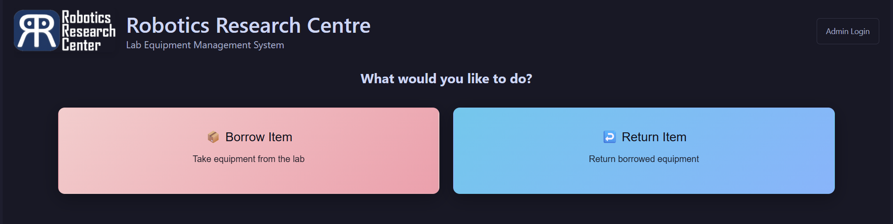

# RRC Inventory Management System

<div align="center">
  
</div>

<div align="center">
  <h3> Simple Lab Equipment Management</h3>
  <p style="color: #f2cdcd;">A web application for managing lab equipment inventory of Robotics Research Centre</p>
</div>

<div align="center">
  


</div>

---

## 📸 Preview

<div align="center">
  
</div>

---

## 🚀 Quick Start

### Prerequisites
- Docker and Docker Compose installed on your system

### Getting Started

1. **First-time setup (run once):**
   ```bash
   ./setup.sh
   ```

2. **Start the application in server:**
   ```bash
   ./start.sh
   ```

3. **Access the system from other devices:**
   - **Main Application**: [Link](http://10.2.131.214)


> **🌐 Network Access Note:** This website is hosted locally on a server. To access it, you need to be connected to **wifi@iiith** or use **OpenVPN** to connect to the IIIT network.

4. **Stop the application in the server:**
   ```bash
   ./stop.sh
   ```

---

## 🛠️ Technology Stack

<table align="center">
<tr>
<td align="center"><strong>Frontend</strong></td>
<td align="center"><strong>Backend</strong></td>
<td align="center"><strong>Database</strong></td>
<td align="center"><strong>Deployment</strong></td>
</tr>
<tr>
<td align="center">SvelteKit + TypeScript</td>
<td align="center">Go + Gin Framework</td>
<td align="center">PostgreSQL</td>
<td align="center">Docker Compose</td>
</tr>
</table>

---

## ✨ Features

### 👥 For Students & Staff
- **Borrow Equipment**: Submit requests with photos and details
- **Return Items**: Mark items as returned when done
- **Track Status**: View all your borrowed items and their status

### 🛡️ For Administrators
- **Approve Requests**: Review and approve/deny borrow requests
- **Manage Returns**: Process return requests and mark items as found/missing
- **View History**: Complete searchable history of all equipment
- **Admin Management**: Add/remove administrators (Super Admin only)

---

## 📖 Usage

1. **Visit** [link](http://10.2.131.214) in your web browser
2. **Students**: Use the main interface to borrow and return equipment
3. **Admins**: Click the admin button and login to manage the system

> **🔗 Access Requirements:** Make sure you are connected to **wifi@iiith** or have **OpenVPN** configured to access the IIIT network before using the system.

---

## 🔧 Management Commands

```bash
./setup.sh      # First-time setup (builds Docker images)
./start.sh      # Start all services
./stop.sh       # Stop all services  
./logs.sh       # View system logs
```

---

<div align="center" style="border-top: 2px solid #f2cdcd; padding-top: 20px; margin-top: 40px;">
  <p style="color: #cdd6f4;">Created with ❤️ for Robotics Research Centre</p>
  <p>
    <a href="https://github.com/Srindot" style="color: #f2cdcd; text-decoration: none;">👨‍💻 Developer</a> | 
    <a href="https://github.com/catppuccin/catppuccin" style="color: #f2cdcd; text-decoration: none;">🎨 Theme</a>
  </p>
</div>
