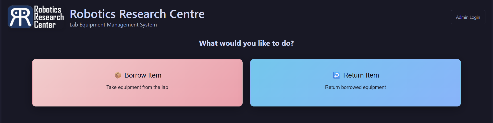

# RRC Inventory Management System

<div align="center">
  
</div>

<div align="center">
  <h3> Simple Lab Equipment Management</h3>
  <p style="color: #f2cdcd;">A web application for managing lab equipment inventory of Robotics Research Centre</p>
</div>

<div align="center">
  


</div>

---

## 📸 Preview

<div align="center">
  
</div>

---

## 🚀 Quick Start

### Prerequisites
- Docker and Docker Compose installed on your system

### Getting Started

1. **First-time setup (run once):**
   ```bash
   ./setup.sh
   ```

2. **Start the application:**
   ```bash
   ./start.sh
   ```

3. **Network access (host IP)**
  Use the server IP to access the application. mDNS/Bonjour support has been removed from this distribution; IP access is more reliable across networks and environments.

4. **Access the system:**
  - **Local Access**: http://localhost
  - **Network Access** (via IP): http://[SERVER-IP]
   - **Admin Login**: the credentials you set in `.env` (see below)

> **🔐 Admin credentials:** Copy `.env.example` to `.env` and set `POSTGRES_PASSWORD`,
> `ADMIN_USERNAME` and `ADMIN_PASSWORD` before the first start. The first admin account is
> created only once, on an empty database. If `ADMIN_PASSWORD` is left empty, a random
> password is generated and printed in the backend logs (`./logs.sh`). Never commit `.env`.

### 🖨️ 3D printer status

The **3D Printers** page shows live status for the lab's Bambu Lab P1S printers -
whether each one is free or printing, progress, time remaining, temperatures and a
camera view (about one frame every two seconds, which is the fastest the P1S allows
over the local network). Anyone can view it.

**Stopping a print is admin-only.** Logged-in admins get a Stop button on a
running printer, with a confirmation naming the job; the action is recorded and
shown on the card ("Last stopped by ..."). Everyone else sees status only - if
they need a print stopped, they ask an admin. That is the one command the system
can send; nothing else writes to the printers.

Configure the printers in `.env`:

```
PRINTERS=Name|host|serial|accesscode,Name2|host2|serial2|accesscode2
```

Enable **LAN Only Mode** on each printer, then read its access code off the screen.
`tools/printer_discover.py` prints the name, IP and serial of every printer on the
network. Leave `PRINTERS` unset and the page simply shows nothing.

> The server must be able to reach the printers' network. Access codes are
> credentials - keep them in `.env`, never in the repo.

**If a printer's access code changes** (toggling LAN mode regenerates it), the
printer page shows an **⚠️ Access code changed** warning on that printer, and a
logged-in admin can paste the new code straight into the page. It reconnects by
itself - no editing `.env`, no restart, no downtime. The new code is saved in the
database and overrides `PRINTERS` from then on, so it survives restarts too.

### 🧵 AMS filament

Printers with an AMS show every slot: material, colour, how much is left, and
which one is feeding, plus the unit's humidity reading and temperature. The
external spool is shown too.

All of it comes from the spool's RFID tag, so it is only as good as what the
printer knows: genuine Bambu spools identify themselves, while third-party
filament has no tag and shows whatever was set by hand on the printer screen,
with the amount as "? left".

### 📤 Sending files to a printer

Anyone can send a sliced `.3mf` or `.gcode` from the **3D Printers** page - drag
it onto the printer's card or tap to choose one. The file lands on the printer's
storage, and the print is started from the printer's own screen once somebody
has checked the plate is clear. That removes the need to switch onto the printer
wifi just to press Print in Bambu Studio; slicing still happens in Studio.

File names should start with the owner's name (`srinath_bracket.3mf`) - the
printer reports the file name, so that is how the site shows whose print is
running. Admins can delete files from the printer to stop the storage filling up.

> Uploading is open to anyone who can reach the site, on the reasoning that it
> only writes a file. Starting a print, stopping one, and deleting files are all
> admin-only. To make uploading admin-only too, move the two
> `api.POST/GET("/printers/:id/files"...)` routes into the `admin` group in
> `backend/main.go`.

### 🎥 Motion Capture Lab booking

Open **Motion Capture Lab** from the home page (or go to `/mocap`) for a week calendar of
who has the lab. Click any empty slot to book it - no approval, the slot just has to be
free. Bookings are cancelled by whoever made them using the phone number they booked with,
and admins can delete any booking from the **Mocap Bookings** tab.

> **🌐 Network Access Note:** This website is hosted locally on a server. To access it, you need to be connected to **wifi@iiith** or use **OpenVPN** to connect to the IIIT network.

5. **Stop the application:**
   ```bash
   ./stop.sh
   ```

---

## 💾 Data, backups and portability

All data lives in Docker named volumes, so it survives `./stop.sh` / `./start.sh`,
reboots and rebuilds:

| Volume | Holds |
|---|---|
| `postgres_data` | Loans, bookings and admin accounts |
| `uploads_data` | Item photos |

> ⚠️ `docker compose down -v` deletes those volumes and everything in them. Plain
> `down` (what `./stop.sh` uses) is safe.

### Making a backup

```bash
./backup.sh
```

Writes one self-contained archive to `backups/` holding a full database dump plus
every item photo. Copy that single file anywhere - a laptop, a pen drive, cloud
storage - and it is everything needed to rebuild the system.

### Restoring

```bash
./restore.sh backups/rrc-backup-20260811-205403.tar.gz
```

Replaces the current database and photos with the contents of the archive, after
asking for confirmation. This is also how you move the system to a new machine:
clone the repo there, copy the `.env` and the archive over, `./start.sh`, then
restore.

### Automatic nightly backups (optional)

```bash
crontab -e
# then add, adjusting the path:
0 2 * * * cd /home/USER/RRC-Inventory && ./backup.sh >> backups/backup.log 2>&1
```

Old archives are never deleted automatically, so prune `backups/` occasionally.

Admins can also export **Loans** and **Mocap Bookings** as CSV from the dashboard
for a human-readable copy (spreadsheets, reports) - though CSV does not include
photos, so it is not a substitute for `./backup.sh`.

---

## 🛠️ Technology Stack

<table align="center">
<tr>
<td align="center"><strong>Frontend</strong></td>
<td align="center"><strong>Backend</strong></td>
<td align="center"><strong>Database</strong></td>
<td align="center"><strong>Deployment</strong></td>
</tr>
<tr>
<td align="center">SvelteKit + TypeScript</td>
<td align="center">Go + Gin Framework</td>
<td align="center">PostgreSQL</td>
<td align="center">Docker Compose</td>
</tr>
</table>

---

## ✨ Features

### 👥 For Students & Staff
- **Borrow Equipment**: Submit requests with photos and details
- **Return Items**: Mark items as returned when done
- **Track Status**: View all your borrowed items and their status

### 🛡️ For Administrators
- **Approve Requests**: Review and approve/deny borrow requests
- **Manage Returns**: Process return requests and mark items as found/missing
- **View History**: Complete searchable history of all equipment
- **Admin Management**: Add/remove administrators (Super Admin only)

---

## 📖 Usage

1. **Visit** http://[SERVER-IP] in your web browser (replace [SERVER-IP] with your server's LAN IP)
2. **Students**: Use the main interface to borrow and return equipment
3. **Admins**: Click the admin button and login to manage the system

> **🔗 Access Requirements:** Make sure you are connected to **wifi@iiith** or have **OpenVPN** configured to access the IIIT network before using the system.

Note: mDNS/Bonjour references have been removed. Use the server IP address to access the application.

---

## 🔧 Management Commands

```bash
./setup.sh             # First-time setup (builds Docker images)
./start.sh             # Start all services
./stop.sh              # Stop all services  
./logs.sh              # View system logs
```

---

<div align="center" style="border-top: 2px solid #f2cdcd; padding-top: 20px; margin-top: 40px;">
  <p style="color: #cdd6f4;">Created with ❤️ for Robotics Research Centre</p>
  <p>
    <a href="https://github.com/Srindot" style="color: #f2cdcd; text-decoration: none;">👨‍💻 Developer</a> | 
    <a href="https://github.com/catppuccin/catppuccin" style="color: #f2cdcd; text-decoration: none;">🎨 Theme</a>
  </p>
</div>
